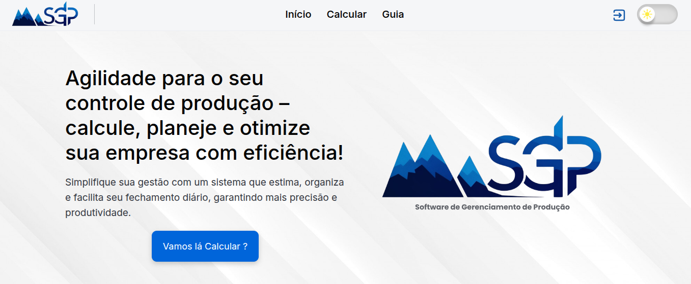

# SGP - Sistema de Gerenciamento de Produção

O **SGP (Sistema de Gerenciamento de Produção)** é uma ferramenta web desenvolvida para resolver um problema real em ambiente industrial. Criado com **HTML5**, **CSS3** e **JavaScript**, o sistema realiza o **cálculo diário do saldo de caixas utilizadas na produção**, ajudando equipes operacionais a manterem um controle preciso da capacidade de armazenamento e facilitando o planejamento da produção.

---

## 🧩 Problema Real Resolvido

Na empresa onde trabalho, lidamos com um túnel de congelamento com capacidade para armazenar até **10.000 caixas**. Frequentemente, essa capacidade era ultrapassada por falta de controle, o que gerava atrasos e dificuldades na organização da produção. 

O **SGP** foi criado justamente para **evitar esse gargalo**: ele calcula automaticamente a quantidade total de caixas no final do dia, alertando a equipe para que possa se planejar com antecedência e direcionar os excedentes para outro local.

---

## ⚙️ Funcionalidades

- ✅ Cálculo automático da quantidade de caixas produzidas no dia  
- ✅ Exibição clara e direta do saldo final  
- ✅ Organização do apontamento de produção diária  
- ✅ Interface intuitiva e responsiva  
- ✅ Sem necessidade de instalação ou backend  

---

## 🖼️ Telas do Sistema

### Tela de Login

O sistema começa com uma tela simples e objetiva de login:

---

### Página Principal

Após o login, o usuário acessa a área principal para iniciar os apontamentos de produção:

---

## 📊 Etapas do Cálculo de Caixa no Final do Dia

### 1. Quantidade de Carcaças
O sistema solicita a **quantidade de carcaças produzidas** no dia. São dois valores inseridos manualmente:

---

### 2. Entrada de Caixas no Túnel
O próximo passo é informar a **quantidade de caixas que entrou no túnel** de congelamento:

---

### 3. Saída de Caixas do Dia Anterior
Em seguida, informa-se a **quantidade de caixas que será retirada** (relativa ao dia anterior):

---

### 4. Resultado Final do Cálculo
O sistema realiza o **cálculo total do saldo no túnel**, levando em conta:

- As carcaças do dia  
- A entrada do dia  
- A saída do dia anterior (que deve ser subtraída)  

Resultado: uma previsão clara do espaço ocupado.

---

## 🛠 Tecnologias Utilizadas

- **HTML5** – Estrutura semântica da aplicação  
- **CSS3** – Estilização customizada com design responsivo  
- **JavaScript** – Lógica e interação com o usuário  

---

## 🎯 Público-Alvo

Empresas de produção, especialmente indústrias que trabalham com armazenagem e controle de fluxo de produção em unidades físicas (como caixas, pallets ou lotes).

---

## 🎨 Paleta de Cores e Tipografia

- **Fonte principal:** Inter

### Paleta:
- `#000000` (Preto)  
- `#0A1E40` (Azul escuro)  
- `#165BAA`, `#0065DA`, `#40A8F5` (Azuis intermediários)  
- `#C0C2C7`, `#F5F6F8`, `#ECEEF2` (Cinzas claros)  
- `#24272F`, `#353841`, `#5F6268` (Cinzas escuros)  
- `#FF0000` (Vermelho para alertas)

---

## 👩‍💻 Autor

Desenvolvido por 
**Felipe Lopez**  

---

## 🙏 Agradecimentos

Primeiramente, agradeço a Deus por me guiar nas dificuldades. Sou grato à minha família, que sempre esteve ao meu lado, oferecendo suporte. Também expresso minha gratidão à equipe de produção da empresa, que me inspirou e colaborou na criação deste sistema.